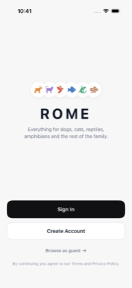
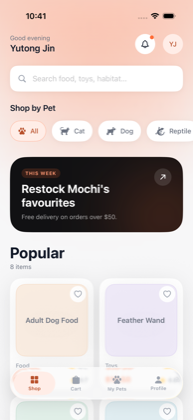
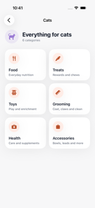
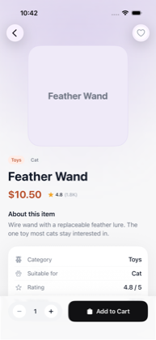
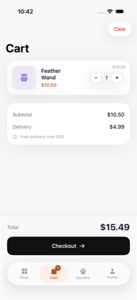
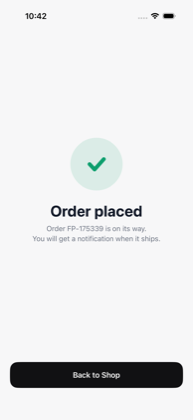
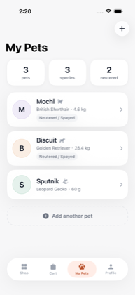
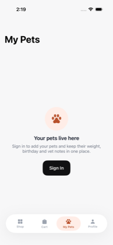
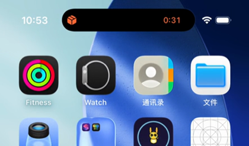

<div align="center">


# ROME

**A pet supplies shop for iOS.** Dogs, cats, reptiles, amphibians, birds, fish and small pets — each with the categories that actually apply to them.

SwiftUI · iOS 26 · No third-party dependencies

</div>

---

<div align="center">


<sub><i>Pull to refresh → ambient colour following the species → the quantity fan → checkout → the Live Activity.<br>Recorded by a UI test driving the real app — see <a href="docs/record-demo.sh">docs/record-demo.sh</a>.</i></sub>

</div>

---

|  |  |  |  |
|:--:|:--:|:--:|:--:|
|  |  |  |  |
| Welcome | Shop | Categories | Product |
|  |  |  |  |
| Cart | Order placed | My Pets | Guest gate |

<div align="center">

<br><sub><i>The order continues on the Dynamic Island after the app is closed.</i></sub>
</div>

---

## What it does

- **Browse** by species → category → product, with a detail page carrying variants, rating and description
- **Cart and checkout** — quantity stepping, swipe to delete, delivery options, an order confirmation
- **My Pets** — name, species, breed, weight, birthday, neutered status and free-text notes
- **Guest mode** — browsing is open to everyone; an account is only required to save something
- **Pull to refresh** with a paw that grips the top of the list, holds it open while the work runs, then lets go
- **Live Activity** on the Dynamic Island tracking the order from packing to doorstep
- **Liquid Glass** on the floating control layer, and an ambient background that takes its colour from whatever is on screen

## Running it

```bash
open ROME.xcodeproj      # Xcode 26+, iOS 26.1 simulator
```

No package resolution step, no API keys, no `.env`. The catalogue is bundled, so the app works offline on first launch.

## Architecture

```
ROME/
├── DesignSystem/     Tokens (colour, type, spacing, radius, elevation)
│   ├── Components/   Reusable views built only from those tokens
│   └── Modifiers/    Card surface, press feedback, staggered entrance
├── Models/           Pet, Product, CartItem, PetSpecies, ProductCategory
├── Data/             DataStore protocol + in-memory implementation
├── State/            @Observable stores: Auth, Cart, Pets, Favorites
└── Features/         One folder per tab, plus the auth flow

ROMEShared/           ActivityAttributes, compiled into both targets
ROMEWidgets/          Widget extension: Live Activity and Dynamic Island
```

**Every visual value comes from a token.** There are no hardcoded colours, sizes or corner radii in feature code — a component that needs a new value gets it added to the token set rather than inlined.

**Persistence sits behind one protocol.** `DataStore` is the single seam between the UI and storage; today the only implementation is in-memory, and swapping in a real backend means adding a type, not touching views.

## Decisions worth explaining

<details>
<summary><b>The primary button is black, not orange</b></summary>

<br>

The brand colour is `#FF6B35`. White text on it measures **2.84:1**, which fails WCAG AA (4.5:1 for normal text). So the accent cannot fill a button that carries a label.

Measured across the palette:

| | Contrast | |
|---|---|---|
| white on orange 500 | 2.84:1 | ✗ fails AA |
| white on orange 700 | 4.98:1 | ✓ AA |
| white on ink `#111113` | ~18:1 | ✓ AAA |

The rule that follows: **ink fills every primary action; the accent is reserved for selected chips, prices, rating stars and badges** — places where it carries no small text. Where orange must carry text, it's the 700 step.

</details>

<details>
<summary><b>Pull to refresh is hand-built, not <code>.refreshable</code></b></summary>

<br>

The system control owns its snap-back: it releases the content on its own curve the moment the work completes. That leaves no held-open state for anything to be gripping, so "a paw holds the list down, then lets go" is not expressible through it.

Here the revealed strip is ordinary layout — a spacer whose height the view sets — which makes the ending animatable. The paw opens its toes first, and only ~110 ms later does the content spring back. Without that gap it reads as a shove rather than a release.

One subtlety: a spring driving only the spacer's height stops dead at zero, because a frame cannot be negative — and the overshoot is the point. Negative values are carried as an `offset` instead.

</details>

<details>
<summary><b>Guest is a session state, not "signed out"</b></summary>

<br>

```swift
enum Session {
    case signedOut          // stopped at the welcome screen
    case guest              // inside the app, owns no account
    case signedIn(UserAccount)
}
```

Two different questions fall out of this, and conflating them is where the bugs live:

- `hasEntered` — may this person see the app? (drives the root view)
- `isSignedIn` — does this person have an account? (gates My Pets and checkout)

A guest reaching My Pets gets a gate rather than an empty list, and signing in from there leaves the tab stack intact — the session changes underneath a screen that never unmounts.

</details>

<details>
<summary><b>Product images are text placeholders, deliberately</b></summary>

<br>

`PlaceholderThumbnail` renders the product's name where the photo will go. It occupies the exact frame and aspect ratio a real image will occupy, so dropping in an `AsyncImage` later is a change to one file — no layout anywhere else moves.

This is also why product cards have no separate title line under the thumbnail: the thumbnail already *is* the name, and printing it twice looked like a bug.

</details>

<details>
<summary><b>The quantity fan is one <code>HStack</code> with negative spacing</b></summary>

<br>

Changing the quantity spreads copies of the product out from behind the front one. There is no per-copy offset arithmetic behind it — the whole effect is a stack whose spacing animates from a negative value to a smaller one:

```swift
HStack(spacing: visibleCount <= 1 ? -36 : -12) { … }
```

Negative spacing makes siblings overlap, so at rest the copies hide behind the front one; animating the spacing spreads them. Layout does the work and the spring only has one number to ride. Depth comes from scale, brightness and `zIndex` falling off with distance from the middle.

Past five copies the fan stops reading as a quantity and starts reading as clutter, so the remainder becomes a `+N` badge.

</details>

<details>
<summary><b>Where Liquid Glass is — and is not</b></summary>

<br>

Glass belongs to the layer that floats above content, so it is on the tab bar, the bottom action bars and the toast. It is deliberately **not** on product cards, pet cards or the detail info card: those are content, and putting glass on them makes glass on glass, which the HIG calls out directly.

The tab bar's selected pill and the bar itself are sibling glass shapes, so they sit inside a `GlassEffectContainer` — without it each samples the background independently and you get two stacked materials instead of one blended surface.

Adding the ambient background surfaced a bug this made obvious: `PlaceholderThumbnail` was a wash of the species tint, and the field behind it is the *same* tint, so products dissolved into the page. The thumbnail now has an opaque base under its tint and reads as an object against anything.

</details>

<details>
<summary><b>The tab bar hides on pushed screens</b></summary>

<br>

Found by testing, not by design review. Product detail and checkout own the bottom edge with their own action bars; a floating tab bar on top of them swallowed the taps, so "Add to Cart" silently switched to the Cart tab instead.

Each tab now owns a `NavigationPath`, and the bar is shown only when the active tab is at its root.

</details>

## Testing

UI tests drive the real app through both journeys end to end and capture a screenshot at each step — the images above are their output, not hand-taken.

```bash
xcodebuild test -scheme ROME \
  -destination 'platform=iOS Simulator,name=iPhone 17 Pro'
```

| Suite | Covers |
|---|---|
| `FlowWalkthroughTests` | sign in → browse → product → cart → checkout → order placed |
| `GuestModeTests` | browse as guest → blocked at My Pets → sign in → unlocked |
| `DemoRecordingTests` | not a test — the paced script behind the walkthrough above |

Several real defects surfaced this way rather than by inspection: the tab bar swallowing taps, a text field made invisible to the accessibility tree by `opacity(0)`, prices rendering as `US$10.50` under a non-US locale, and a duplicated product name on every card.

> One trap worth recording: `docs/record-demo.sh` passes `-parallel-testing-enabled NO`. With parallel testing on, Xcode runs the app inside a `Clone N of <device>` simulator while `simctl` records the original — which yields a few seconds of an idle home screen instead of a walkthrough.

## Scope

Everything user-facing is built. What is deliberately **not**:

| Not built | Why |
|---|---|
| Payment processing | Portfolio build. The checkout flow, validation and confirmation are complete; only the gateway is stubbed. |
| Real authentication | Any credentials are accepted. `AuthState` is a placeholder behind a stable interface. |
| Persistence | Data lives in memory and resets on relaunch. `DataStore` is the seam a real backend plugs into. |
| Product photography | See the placeholder note above. |

These are boundaries, not gaps — each one sits behind an interface chosen so that filling it in does not disturb the code around it.

---

<div align="center">
<sub>Built by <a href="https://github.com/R1chi33333">Yutong Jin</a></sub>
</div>
